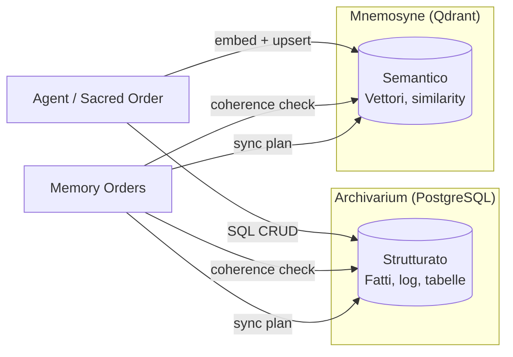
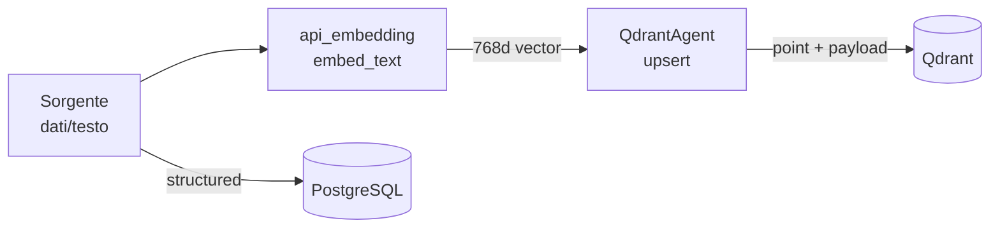
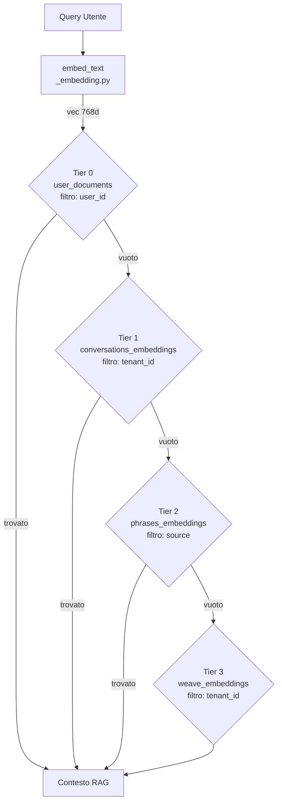
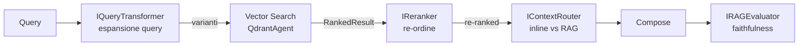

---
tags:
  - rag
  - memory
  - architecture
  - vector-search
  - embedding
---

# RAG — Retrieval-Augmented Generation

> **Last updated**: April 18, 2026 14:00 UTC

<p class="kb-subtitle">Come Vitruvyan costruisce il suo sistema RAG: doppia memoria (PostgreSQL + Qdrant), embedding layer, cascade di retrieval, qualità contrattuale e isolamento tenant.</p>

---

## 1. Cos'è il RAG in Vitruvyan

RAG non è un modulo singolo — è un **sistema emergente** composto da quattro strati cooperanti:

| Strato | Cosa fa |
|--------|---------|
| **Embedding** | Trasforma testo (e immagini) in vettori semantici normalizzati |
| **Doppia Persistenza** | Archivia strutturato (Archivarium / PostgreSQL) e semantico (Mnemosyne / Qdrant) |
| **Retrieval** | Recupera contesto rilevante tramite similarity search + cascade multi-tier |
| **Quality Enforcement** | Garantisce faithfulness, attribution e governance delle collezioni |

Il grafo LangGraph decide **quando** attivare il retrieval (`qdrant_node`, `semantic_grounding_node`). Il sistema RAG decide **cosa** recuperare e **come valutarlo**.

---

## 2. Doppia Memoria — Archivarium e Mnemosyne

Il sistema mantiene due memorie complementari che si sincronizzano continuamente.



### Archivarium (PostgreSQL)

- **Primitive di accesso**: `PostgresAgent` — SQL puro, senza assunzioni di schema.
- **Chi lo usa**: ogni Sacred Order che ha bisogno di persistenza strutturata.
- **Env**: `POSTGRES_HOST`, `POSTGRES_PORT`, `POSTGRES_DB`, `POSTGRES_USER`, `POSTGRES_PASSWORD`.
- **Codice**: `vitruvyan_core/core/agents/postgres_agent.py`

### Mnemosyne (Qdrant)

- **Primitive di accesso**: `QdrantAgent` — gestione collezioni, upsert, similarity search.
- **Governance**: `QdrantAgent` include runtime guards (dichiarazione collezioni, payload `source`, metriche).
- **Env**: `QDRANT_HOST`, `QDRANT_PORT` *(o `QDRANT_URL`)*, `QDRANT_API_KEY`.
- **Codice**: `vitruvyan_core/core/agents/qdrant_agent.py`

### Memory Orders — Sincronizzazione

Memory Orders monitora la **deriva di coerenza** tra le due memorie (conteggio righe vs conteggio vettori) e pianifica la sincronizzazione quando la soglia di deriva viene superata.

- Health aggregation unificata (datastores + embedding + bus)
- Drift calculation e sync planning (LIVELLO 1, nessuna I/O diretta)
- Esecuzione sincronizzazione tramite LIVELLO 2 adapter

Doc: [Memory Orders](../../internal/orders/MEMORY_ORDERS.md)

---

## 3. Embedding Layer

### Modelli attivi

| Modello | Tipo | Dimensione | Endpoint |
|---------|------|-----------|---------|
| `nomic-ai/nomic-embed-text-v1.5` | Testo | **768** | `/v1/embeddings/create`, `/v1/embeddings/batch` |
| `nomic-ai/nomic-embed-vision-v1.5` | Immagine (base64) | **768** | `/v1/embeddings/image`, `/v1/embeddings/image/batch` |

Entrambi i modelli vivono nella **stessa latent space** a 768 dimensioni: una ricerca coseno cross-modale (testo → immagini o viceversa) funziona senza migrare collezioni.

### Accesso centralizzato — `_embedding.py`

Tutti i nodi LangGraph DEVONO accedere all'embedding tramite il client centralizzato:

```python
from core.orchestration.langgraph.node._embedding import embed_text, embed_batch, EXPECTED_DIM

# Singolo testo
vec = embed_text("descrizione del prodotto")          # List[float], len == 768

# Batch
vecs = embed_batch(["testo 1", "testo 2", "testo 3"]) # List[List[float]]

# Costante dimensione canonica
assert len(vec) == EXPECTED_DIM  # 768
```

**Regola**: direct `httpx.post()` verso `api_embedding` dai nodi è forbidden. Tutto passa da `_embedding.py`.

Eccezioni documentate:
- `semantic_grounding_node` → delega a `VSGSEngine` (boundary infrastrutturale)
- `intent_detection_node` → chiama `{BABEL_API_URL}/v1/embeddings/multilingual` (routing interno Babel Gardens, servizio diverso)

### Env var per servizio

| Servizio | Env var | Default |
|----------|---------|---------|
| `graph` (nodi LangGraph) | `EMBEDDING_API_URL` | `http://embedding:8010` |
| `babel_gardens` | `EMBEDDING_SERVICE_URL` | `http://embedding:8010` |
| `memory_orders` / listener | `EMBEDDING_API_URL` | `http://embedding:8010` |
| `codex_hunters` | `EMBEDDING_API_URL` | `http://embedding:8010` |
| `pattern_weavers` | `EMBEDDING_URL` | `http://embedding:8010` |

---

## 4. Collezioni Qdrant

### Tier e owner

Le collezioni sono dichiarate in `vitruvyan_core/contracts/rag.py` con tier, owner e purpose. Ogni punto DEVE avere `source` e `created_at` nel payload.

| Tier | Tipo | Retention |
|------|------|-----------|
| `CORE` | Infrastruttura critica del sistema | Permanente |
| `ORDER` | Sacred Order semantics | Persistente |
| `DOMAIN` | Estensioni verticale/dominio | Dominio-specifico |
| `EPHEMERAL` | Temporanea, cache | Breve |

### Collezioni attive dichiarate

| Collezione | Owner | Contenuto | Dimensione |
|------------|-------|----------|-----------|
| `conversations_embeddings` | Memory Orders | Memoria conversazionale per utente | 768 |
| `phrases_embeddings` | Embedding Service | Frasi seed NLP | 768 |
| `weave_embeddings` | Pattern Weavers | Pattern ontologici | 768 |
| `entity_embeddings` | Codex Hunters | Entità estratte | 768 |
| `semantic_states` | VSGS | Grounding semantico | 768 |
| `user_documents` | Graph (upload) | Chunk documenti utente | 768 |

### Naming convention

```
[a-z0-9_.]{3,64}
```

Collezioni dominio DOVREBBERO usare `<domain>.<purpose>`. Nomi legacy `semantic_states`, `phrases_embeddings`, etc. sono grandfathered.

---

## 5. Write Path

Come arriva un vettore a Qdrant:



Flussi attivi principali:

| Producer | Collezione | Via |
|----------|------------|-----|
| Graph / `can_node` | `conversations_embeddings` | `_embedding.py` → `QdrantAgent` |
| Embedding Service (sync) | `phrases_embeddings` | interno |
| Pattern Weavers | `weave_embeddings` | `EMBEDDING_URL` → `QdrantAgent` |
| Codex Hunters | `entity_embeddings` | `EMBEDDING_API_URL` → `QdrantAgent` |
| Graph / upload | `user_documents` | Babel chunker → `_embedding.py` → `QdrantAgent` |

Ogni punto persiste un `RAGPayload` con `source`, `created_at`, e opzionalmente `tenant_id`, `domain`, `version`.

---

## 6. Read Path — Cascade di Retrieval

Il retrieval in `qdrant_node` segue una **cascade a 4 tier con early-exit**: si ferma al primo tier che produce risultati rilevanti.



| Tier | Collezione | Priorità | Filtro |
|------|------------|----------|--------|
| 0 | `user_documents` | Massima — contesto caricato dall'utente | `user_id` |
| 1 | `conversations_embeddings` | Alta — memoria conversazionale | `tenant_id` |
| 2 | `phrases_embeddings` | Media — frasi seed NLP | `source` |
| 3 | `weave_embeddings` | Fallback — pattern ontologici | `tenant_id` |

---

## 7. Contratti di Qualità del Retrieval

Il pipeline di retrieval è estendibile tramite quattro interfacce definite in `vitruvyan_core/contracts/retrieval.py`:



| Interfaccia | Scopo | Default |
|-------------|-------|---------|
| `IQueryTransformer` | Pre-retrieval: espansione e varianti query | Pass-through |
| `IReranker` | Post-retrieval: re-ordine con segnale di rilevanza più costoso | No-op (ordine Qdrant) |
| `IContextRouter` | Decide: inline vs RAG vs entrambi | Size-based (≤15k chars → inline) |
| `IRAGEvaluator` | Valuta faithfulness, rilevanza, precisione | Il verticale implementa |

Strutture dati chiave: `RankedResult` (hit con score), `CitationRef` (attribuzione), `EvalResult` (score di qualità), `ContextRouting` (enum routing).

I verticali implementano queste interfacce per adattare il comportamento RAG al loro dominio senza modificare il core.

---

## 8. Long Context — Documenti Utente

Gli utenti possono allegare documenti al chat. Il contenuto è processato da Babel Gardens (`document_chunker.py`) e iniettato come `inline_context` nello stato LangGraph.

Con **"Save to memory"** attivo, i chunk vengono anche embedding-izzati (768-dim) e archiviati in `user_documents` per retrieval persistente nelle sessioni future.

### Endpoint upload

`POST /run/upload` (multipart/form-data) in `api_graph`:

- Tipi MIME accettati: `text/plain`, Markdown, CSV, PDF, JSON
- Dimensione max: 5 MB
- Chunking: sliding window con paragraph-boundary snapping e overlap configurabile
- Output: `inline_context` (testo joined) passato a `run_graph_once()`

I chunk nel contesto inline sono delimitati da `[USER_CONTEXT_START]...[USER_CONTEXT_END]` da `compose_node`.

Doc: [Long Context](../web_ui/long_context.md)

---

## 9. Tenant Isolation

Il RAG supporta multi-tenancy via **payload-based filtering** — nessun namespace Qdrant separato.

- `RAGPayload.tenant_id` viene persistito su ogni punto
- I metodi di search accettano `tenant_id` opzionale per filtrare a query time
- Backward compatible: collezioni senza `tenant_id` nei payload funzionano invariate
- Filtraggio per `user_id` su `user_documents` fornisce isolamento a livello singolo utente

---

## 10. Metriche RAG

Abilitate con `RAG_METRICS=1` (default off):

| Metrica | Cosa misura |
|---------|-------------|
| Search latency | Tempo per ogni ricerca per collezione |
| Result count | Numero di risultati per tier |
| Upsert throughput | Payload size e batch count |
| Governance warnings | Collezioni non dichiarate, mismatch dimensioni |
| Stale detection | Giorni dall'ultimo upsert per collezione |

Snapshot programmabile:

```python
from contracts.rag import get_rag_metrics
summary = get_rag_metrics().summary()
```

CLI QdrantAgent:

```bash
python -m vitruvyan_core.core.agents.qdrant_agent --mode metrics
```

---

## 11. Governance in sintesi

Le regole complete sono nel [Governance Contract](../../contracts/rag/RAG_GOVERNANCE_CONTRACT_V1.md). Punti chiave:

- Ogni collezione DEVE essere dichiarata nel registry (`contracts/rag.py`) prima dell'uso in produzione
- Il payload di ogni punto DEVE includere `source` e `created_at`
- Il modello embedding canonica è `nomic-embed-text-v1.5`, 768-dim — `EXPECTED_DIM` in `_embedding.py` è il single source of truth
- `RAG_ENFORCE_REGISTRY=strict` blocca scritture su collezioni non dichiarate
- `RAG_ENFORCE_REGISTRY=warn` (default) emette solo warning

Bootstrap iniziale:

```bash
python scripts/init_qdrant_collections.py  # crea le collezioni dichiarate
python scripts/audit_rag_collections.py    # verifica registry vs live Qdrant
```

---

## 12. Verticalization

Il core RAG è domain-agnostic. I verticali portano:

- **Schema PostgreSQL** — tabelle, indici, constraints dominio-specifici
- **Collezioni Qdrant dominio** — estensioni entro i vincoli governance
- **Implementazioni retrieval** — `IQueryTransformer`, `IReranker`, `IRAGEvaluator` concreti
- **Adapters** — cosa viene embedding-izzato, archiviato, recuperato, filtrato

---

## 13. Lifecycle Governance — Semantic Warden

Il **Semantic Warden** è il dominio di governance per il ciclo di vita della memoria semantica. Non è un agente autonomo — è un subsystem deterministico di worker, contratti e metriche.

V1 (RAG Lifecycle Ops) fornisce:

| Worker | Funzione | Comando |
|--------|----------|---------|
| `stale_checker` | Rileva collezioni stale, emette eventi bus | `python -m core.rag.lifecycle.stale_checker` |
| `metrics_exporter` | Persiste metriche RAG su PostgreSQL | `python -m core.rag.lifecycle.metrics_exporter --once` |
| `health_report` | Report di salute aggregato (stale + metriche) | `python -m core.rag.lifecycle.health_report` |

Contratti lifecycle in `contracts/rag.py`:

- `CollectionHealthReport` — snapshot salute composito per collezione
- `DeduplicationReport` — risultato scan near-duplicate
- `LifecycleEvent` — envelope eventi bus lifecycle
- `LIFECYCLE_CHANNELS` — 5 canali informativi (`rag.lifecycle.*`)

Doc completa: [RAG Lifecycle Ops — Semantic Warden V1](lifecycle.md)

---

## Riferimenti

| Risorsa | Path |
|---------|------|
| Embedding client (LangGraph) | `vitruvyan_core/core/orchestration/langgraph/node/_embedding.py` |
| QdrantAgent | `vitruvyan_core/core/agents/qdrant_agent.py` |
| PostgresAgent | `vitruvyan_core/core/agents/postgres_agent.py` |
| Contratti retrieval | `vitruvyan_core/contracts/retrieval.py` |
| Registry + governance contract | `vitruvyan_core/contracts/rag.py` |
| RAG Service (Embedding API) | [RAG Service](rag_service.md) |
| Governance Contract (binding) | [RAG Governance Contract V1](../../contracts/rag/RAG_GOVERNANCE_CONTRACT_V1.md) |
| Operations Runbook | [RAG Operations](../../contracts/rag/RAG_GOVERNANCE_OPERATIONS.md) |
| Lifecycle Ops (Semantic Warden) | [RAG Lifecycle Ops](lifecycle.md) |
| Lifecycle workers | `vitruvyan_core/core/rag/lifecycle/` |
| Lifecycle tests (31 test) | `tests/unit/contracts/test_rag_lifecycle.py` |
| Memory Orders | [Memory Orders](../../internal/orders/MEMORY_ORDERS.md) |
