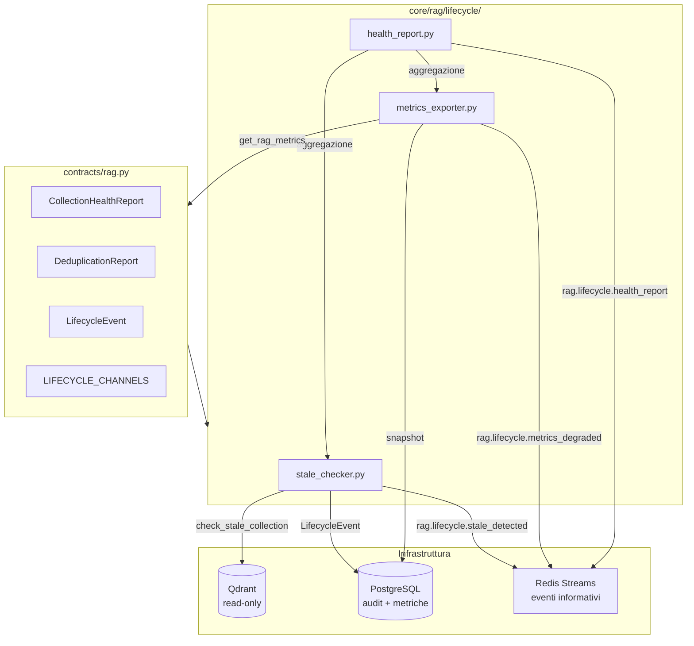

---
tags:
  - rag
  - governance
  - lifecycle
  - semantic-warden
  - monitoring
---

# RAG Lifecycle Ops — Semantic Warden V1

> **Last updated**: April 18, 2026 14:00 UTC

<p class="kb-subtitle">Governance del ciclo di vita della memoria semantica: stale detection, metriche persistenti, health reporting. Il Semantic Warden è un dominio di governance, non un agente autonomo.</p>

---

## 1. Cos'è il Semantic Warden

Il Semantic Warden è il **dominio di governance** responsabile del ciclo di vita della memoria semantica in Vitruvyan.

!!! warning "Non è un agente autonomo"
    Il Semantic Warden **non è** un Sacred Order, **non è** un microservizio, **non è** un agente LLM-driven.
    È un subsystem composto da worker deterministici, contratti e metriche che operano sotto supervisione umana.

| Concetto | Significato |
|----------|-------------|
| **Semantic Warden** | Dominio architetturale — l'intera area di governance lifecycle |
| **RAG Lifecycle Ops** | Implementazione V1 — worker, metriche, eventi informativi |

### Perché esiste

`contracts/rag.py` governa **dichiarazione e accesso** (quali collezioni esistono, come usarle). Nessuno governava il **lifecycle** (cosa succede ai vettori dopo la scrittura — obsolescenza, duplicazione, decay qualitativo, capacità).

Senza governance lifecycle:

- Degradazione silenziosa della qualità retrieval
- Accumulo di script operativi disconnessi senza modello condiviso
- Nessuna visibilità su trend e anomalie

---

## 2. Principi V1

| Principio | Regola |
|-----------|--------|
| **Observe only** | V1 non muta nulla in Qdrant — nessun delete, nessun reindex |
| **Deterministico** | Nessuna decisione lifecycle basata su LLM |
| **Dry-run first** | Ogni worker ha `--dry-run` come default |
| **Informational events** | Gli eventi sul bus sono informativi, nessun listener auto-esegue azioni distruttive |
| **Audit trail** | Ogni azione loggata in PostgreSQL (`rag_lifecycle_events`) |

---

## 3. Architettura



### Posizione nel tree

```
vitruvyan_core/
├── contracts/
│   └── rag.py                  ← tipi, registry, lifecycle contracts
└── core/
    └── rag/                    ← subsystem RAG
        └── lifecycle/          ← RAG Lifecycle Ops (Semantic Warden V1)
            ├── stale_checker.py
            ├── metrics_exporter.py
            └── health_report.py
```

---

## 4. Contract Types

### CollectionHealthReport

Snapshot di salute composito per una singola collezione dichiarata.

```python
from contracts.rag import CollectionHealthReport

report = CollectionHealthReport(
    collection="phrases_embeddings",
    stale_report=stale_report,
    total_points=15000,
    avg_retrieval_score=0.78,
    hit_rate=0.92,
    quality_tier="GOOD",
)
print(report.health_status)  # "HEALTHY" | "DEGRADED" | "STALE" | "EMPTY" | "UNKNOWN"
```

Health status priority:

1. **EMPTY** — zero punti nella collezione
2. **STALE** — dati obsoleti (threshold superato)
3. **DEGRADED** — quality tier POOR o MISS
4. **HEALTHY** — quality tier EXCELLENT, GOOD, o FAIR
5. **UNKNOWN** — nessuna metrica disponibile

### DeduplicationReport

Risultato di una scansione near-duplicate su una collezione. V1: solo rilevamento, nessuna rimozione.

```python
from contracts.rag import DeduplicationReport

report = DeduplicationReport(
    collection="entity_embeddings",
    total_points=5000,
    duplicate_clusters=12,
    duplicate_points=48,
    similarity_threshold=0.98,
)
print(report.duplication_rate)  # 0.0096
```

### LifecycleEvent

Envelope canonico per gli eventi bus del lifecycle.

```python
from contracts.rag import LifecycleEvent

event = LifecycleEvent(
    event_type="stale_detected",
    collection="phrases_embeddings",
    payload={"age_days": 45, "total_points": 15000},
)
# event.source → "rag_lifecycle"
# event.timestamp → auto-populated ISO 8601
```

---

## 5. Workers

### stale_checker.py

Controlla tutte le collezioni dichiarate per obsolescenza. Usa `check_stale_collection()` (già esistente in `contracts/rag.py`).

```bash
# Dry-run (default) — stampa report, nessuna scrittura
python -m core.rag.lifecycle.stale_checker

# Live — pubblica eventi + persiste in PostgreSQL
python -m core.rag.lifecycle.stale_checker --live

# Threshold custom
python -m core.rag.lifecycle.stale_checker --live --threshold-days 60

# Output JSON
python -m core.rag.lifecycle.stale_checker --json
```

Output esempio:

```
RAG Stale Check Report
==================================================
  🟢 semantic_states                ACTIVE (5d)          points=12000
  🟢 phrases_embeddings             ACTIVE (2d)          points=15000
  🔴 conversations_embeddings       STALE (45d)          points=3200
  🟢 entity_embeddings              ACTIVE (1d)          points=8500
  🟢 weave_embeddings               ACTIVE (8d)          points=4100

Total: 5 collections, 1 stale
```

### metrics_exporter.py

Persiste le metriche RAG in-memory (`RAGMetricsCollector`) su PostgreSQL. Può funzionare come sidecar o one-shot.

```bash
# One-shot (cron, healthcheck)
python -m core.rag.lifecycle.metrics_exporter --once

# Sidecar continuo (ogni 60 secondi)
python -m core.rag.lifecycle.metrics_exporter --interval 60

# Con alerting su degradazione
python -m core.rag.lifecycle.metrics_exporter --once --alert-on-degradation --hit-rate-threshold 0.3
```

### health_report.py

Produce un report di salute aggregato per tutte le collezioni. Combina stale detection + metriche retrieval.

```bash
# Report human-readable
python -m core.rag.lifecycle.health_report

# JSON (per dashboard o API)
python -m core.rag.lifecycle.health_report --json

# Pubblica su bus
python -m core.rag.lifecycle.health_report --publish
```

Output esempio:

```
RAG Collection Health Report
============================================================
  🟢 semantic_states                HEALTHY    points=12000   score=0.820  hit_rate=0.950
  🟢 phrases_embeddings             HEALTHY    points=15000   score=0.780  hit_rate=0.920
  🔴 conversations_embeddings       STALE      points=3200    score=0.650  hit_rate=0.780
  🟡 entity_embeddings              DEGRADED   points=8500    score=0.280  hit_rate=0.250
  🟢 weave_embeddings               HEALTHY    points=4100    score=0.710  hit_rate=0.880

Summary: 5 collections — 3 healthy, 1 degraded, 1 stale
```

---

## 6. Eventi Bus

Tutti gli eventi seguono il naming convention `rag.lifecycle.<action>` e sono **informativi only**.

| Canale | Trigger | Payload |
|--------|---------|---------|
| `rag.lifecycle.stale_detected` | Collezione supera soglia di staleness | `{collection, age_days, total_points, status}` |
| `rag.lifecycle.duplicates_found` | Scanner dedup trova cluster (futuro) | `{collection, duplicate_clusters, duplicate_points}` |
| `rag.lifecycle.audit_failed` | Audit CI rileva violazioni | `{violations: [{type, collection, detail}]}` |
| `rag.lifecycle.metrics_degraded` | Hit rate sotto soglia | `{collection, current_hit_rate, threshold, avg_score}` |
| `rag.lifecycle.health_report` | Report di salute generato | `{reports: [...], summary: {total, healthy, degraded, stale}}` |

Le costanti canale sono definite in `contracts/rag.py`:

```python
from contracts.rag import (
    LIFECYCLE_CHANNEL_STALE_DETECTED,
    LIFECYCLE_CHANNEL_DUPLICATES_FOUND,
    LIFECYCLE_CHANNEL_AUDIT_FAILED,
    LIFECYCLE_CHANNEL_METRICS_DEGRADED,
    LIFECYCLE_CHANNEL_HEALTH_REPORT,
    LIFECYCLE_CHANNELS,  # lista completa
)
```

---

## 7. Persistenza — Tabelle PostgreSQL

Due tabelle, auto-create al primo uso via `ensure_schema()`:

### rag_lifecycle_events

Append-only audit trail di tutti gli eventi lifecycle.

| Colonna | Tipo | Nota |
|---------|------|------|
| `id` | `BIGSERIAL` | PK |
| `event_type` | `TEXT` | `stale_detected`, `metrics_degraded`, etc. |
| `collection` | `TEXT` | Nome collezione |
| `payload` | `JSONB` | Dati evento strutturati |
| `source` | `TEXT` | Default `rag_lifecycle` |
| `created_at` | `TIMESTAMPTZ` | Auto |

### rag_metrics_history

Serie temporale di snapshot metriche retrieval.

| Colonna | Tipo | Nota |
|---------|------|------|
| `id` | `BIGSERIAL` | PK |
| `collection` | `TEXT` | Nome collezione |
| `total_searches` | `INTEGER` | Ricerche nella finestra |
| `avg_score` | `REAL` | Score medio retrieval |
| `hit_rate` | `REAL` | Tasso di hit (0–1) |
| `quality_tier` | `TEXT` | EXCELLENT/GOOD/FAIR/POOR/MISS |
| `window_start` | `TIMESTAMPTZ` | Inizio finestra |
| `window_end` | `TIMESTAMPTZ` | Fine finestra |
| `created_at` | `TIMESTAMPTZ` | Auto |

Le DDL sono definite in `contracts/rag.py` (`LIFECYCLE_EVENTS_DDL`, `METRICS_HISTORY_DDL`).

---

## 8. Scope Boundary

### IN scope (V1)

- Stale detection schedulata
- Metriche persistence + export
- Health reporting aggregato
- Eventi bus informativi
- Audit trail PostgreSQL
- Dedup detection (reporting only, futuro prossimo)

### OUT of scope (V1 — esplicitamente differito)

| Capability | Perché è fuori |
|------------|---------------|
| Auto-delete di punti | Nessun rollback in Qdrant, serve staging maturo |
| Compaction semantica | LLM su dati produzione = non auditabile |
| Auto-reindexing | Distruttivo, serve migration executor |
| LLM lifecycle decisions | Viola "deterministic at core" |
| Sacred Order pattern | Non è un Sacred Order — è tooling operativo |

### Evoluzione futura (V2+, basata su evidenza V1)

- **Staged removal**: flagging punti (`_flagged_for_removal`), collezioni quarantine
- **Migration executor**: re-embedding automatizzato + dual-write + cutover
- **Dashboard Grafana**: basato sui dati di `rag_metrics_history`
- **Prometheus exporter**: esposizione metriche per alerting

---

## 9. Configurazione

| Env var | Default | Scopo |
|---------|---------|-------|
| `RAG_STALE_THRESHOLD_DAYS` | `30` | Giorni senza scrittura per considerare stale |
| `RAG_DEDUP_THRESHOLD` | `0.98` | Soglia coseno per near-duplicate |
| `RAG_METRICS` | `0` | Abilita raccolta metriche in-memory |
| `RAG_METRICS_HISTORY` | `1000` | Max entry nel collector in-memory |
| `RAG_ENFORCE_REGISTRY` | `warn` | `warn` / `strict` / `off` |

---

## Riferimenti

| Risorsa | Path |
|---------|------|
| Contract types (lifecycle) | `vitruvyan_core/contracts/rag.py` |
| Stale checker | `vitruvyan_core/core/rag/lifecycle/stale_checker.py` |
| Metrics exporter | `vitruvyan_core/core/rag/lifecycle/metrics_exporter.py` |
| Health report | `vitruvyan_core/core/rag/lifecycle/health_report.py` |
| Unit tests (31 test) | `tests/unit/contracts/test_rag_lifecycle.py` |
| RAG Overview | [RAG — Retrieval-Augmented Generation](index.md) |
| Governance Contract (binding) | [RAG Governance Contract V1](../../contracts/rag/RAG_GOVERNANCE_CONTRACT_V1.md) |
| Operations Runbook | [RAG Operations](../../contracts/rag/RAG_GOVERNANCE_OPERATIONS.md) |
