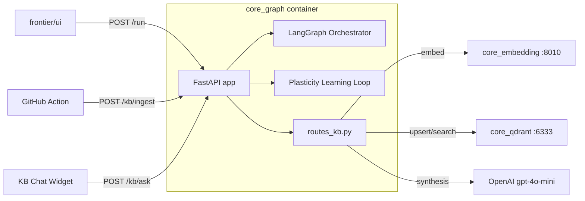

# API Graph

Il servizio **API Graph** è l'**orchestration gateway** di Vitruvyan: espone HTTP per l'esecuzione del pipeline LangGraph, la governance Plasticity, l'audit monitoring e — dalla v2.1 — i capability endpoint della Knowledge Base.

> **Porta host:** `10004` → container `8004`  
> **Container:** `core_graph`  
> **Stack:** Python / FastAPI

---

## Endpoint principali

### Pipeline LangGraph

| Metodo | Path | Descrizione |
|---|---|---|
| `POST` | `/run` | Esegue il grafo con `{input_text, user_id}` |
| `POST` | `/graph/dispatch` | Dispatch con audit monitoring |
| `POST` | `/dispatch` | Alias backward-compat |
| `POST` | `/run/upload` | Esegue il grafo con documento allegato (chunking Babel Gardens) |

### Health & Monitoring

| Metodo | Path | Descrizione |
|---|---|---|
| `GET` | `/health` | Health check del servizio |
| `GET` | `/metrics` | Prometheus metrics |
| `GET` | `/audit/graph/health` | Stato audit monitoring sessione corrente |
| `GET` | `/audit/graph/metrics` | Metriche performance esecuzioni |
| `POST` | `/audit/graph/trigger` | Audit manuale (admin) |
| `POST` | `/audit/grafana/webhook` | Webhook alert Grafana |

### Plasticità (Learning Loop)

| Metodo | Path | Descrizione |
|---|---|---|
| `POST` | `/api/feedback` | Feedback thumbs up/down da UI |
| `GET` | `/api/plasticity/stats` | Statistiche PlasticityManager |
| `GET` | `/api/plasticity/health` | Report salute learning system |
| `POST` | `/api/plasticity/cycle` | Trigger manuale ciclo apprendimento |

### RAG Admin (Semantic Warden)

| Metodo | Path | Descrizione |
|---|---|---|
| `GET` | `/admin/rag/health` | Health snapshot tutte le collection |
| `GET` | `/admin/rag/metrics` | Metriche retrieval storiche |
| `GET` | `/admin/rag/events` | Feed eventi lifecycle RAG |

### Knowledge Base

| Metodo | Path | Auth | Descrizione |
|---|---|---|---|
| `POST` | `/kb/ingest` | `X-KB-Secret` header | Ingest file da GitHub Action → chunking → embedding → upsert `vitruvyan_kb` |
| `POST` | `/kb/ask` | — | RAG diretto: embed query → Qdrant → gpt-4o-mini → risposta con sources |

---

## KB Endpoints

### `POST /kb/ingest`

Riceve contenuto file dal GitHub Action, esegue chunking heading-aware e upsert su Qdrant `vitruvyan_kb`.

```json
{
  "files": [
    { "path": "docs/pages/getting-started/overview.md", "content": "# Overview\n..." }
  ],
  "deleted": ["docs/pages/old-page.md"]
}
```

**Response:**

```json
{
  "status": "ok",
  "files_processed": 1,
  "files_deleted": 0,
  "total_chunks": 12,
  "points_upserted": 12,
  "errors": []
}
```

- Auth: header `X-KB-Secret` (env `KB_INGEST_SECRET`)
- Chunking: heading-aware (H1/H2), max 1200 chars, fallback a paragrafi
- IDs deterministici UUID5 → idempotente, zero duplicati
- Pre-delete automatico dei vecchi chunk prima di upsert (gestisce cambio numero sezioni)

### `POST /kb/ask`

Endpoint RAG diretto per la chat widget della KB docs.

```json
{ "query": "Come funzionano i Sacred Orders?", "top_k": 5 }
```

**Response:**

```json
{
  "answer": "I Sacred Orders sono...",
  "sources": [
    { "url": "/system-core/sacred-orders", "heading": "Sacred Orders", "excerpt": "..." }
  ],
  "query_ms": 1240
}
```

Pipeline: embedding via `core_embedding` (nomic-embed-text-v1.5) → ricerca Qdrant `vitruvyan_kb` → sintesi gpt-4o-mini.

> Vedi anche: [KB Auto-Ingest](./kb-auto-ingest) per la pipeline di aggiornamento automatico.

---

## Configurazione (env vars)

| Variabile | Default | Descrizione |
|---|---|---|
| `EMBEDDING_API_URL` | `http://embedding:8010/v1/embeddings/batch` | URL embedding service |
| `QDRANT_URL` | `http://core_qdrant:6333` | URL Qdrant interno |
| `KB_COLLECTION` | `vitruvyan_kb` | Collection Qdrant KB |
| `KB_INGEST_SECRET` | — | Secret per autenticare GitHub Action |
| `OPENAI_API_KEY` | — | Chiave OpenAI (sintesi kb.ask + gpt-4o-mini) |
| `QDRANT_HOST` | `core_qdrant` | Host Qdrant (fallback se QDRANT_URL non impostato) |
| `QDRANT_PORT` | `6333` | Porta Qdrant |
| `PLASTICITY_ENABLED` | `true` | Abilita learning loop |
| `AUDIT_ENABLED` | `false` | Abilita audit monitoring LangGraph |

---

## Architettura interna


