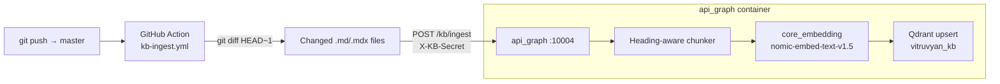

# KB Auto-Ingest

Il sistema di **auto-ingest** mantiene la collection `vitruvyan_kb` su Qdrant automaticamente sincronizzata con i contenuti del repo `vitruvyan/vitruvyan-docs` ad ogni push su `master`.

---

## Pipeline



**Trigger:** qualsiasi push a `master` che modifichi file in `pages/**/*.md` o `pages/**/*.mdx`.

---

## GitHub Action (`.github/workflows/kb-ingest.yml`)

L'Action:
1. Fa `checkout` con `fetch-depth: 2` per avere `HEAD~1`
2. Esegue `git diff --name-status HEAD~1 HEAD` filtrando per `.md`/`.mdx`
3. Legge il contenuto dei file modificati/aggiunti; raccoglie i path dei file eliminati
4. Prepara il payload JSON `{"files": [...], "deleted": [...]}`
5. `POST /kb/ingest` con header `X-KB-Secret`

**Secrets GitHub richiesti** (in `vitruvyan/vitruvyan-docs` → Settings → Secrets):

| Secret | Valore |
|---|---|
| `API_GRAPH_URL` | `http://<VPS_IP>:10004` |
| `KB_INGEST_SECRET` | Valore di `KB_INGEST_SECRET` nel VPS `.env` |

---

## Chunking strategy

Il chunker replica fedelmente `ingest_kb_v2.py`:

| Parametro | Valore |
|---|---|
| Strategia | Heading-aware (H1/H2) |
| Max chunk | 1200 chars (~300 token) |
| Fallback | Split a paragrafi se sezione > max |
| Prefisso | `## {heading}\n\n` incluso nel testo del chunk |
| Frontmatter | Rimosso prima del chunking |
| IDs | UUID5 deterministici: `vitruvyan_kb::<path>::<chunk_index>` |

Gli ID deterministici garantiscono che re-ingest dello stesso file produca **upsert**, non duplicati. Prima dell'upsert, i chunk precedenti del file vengono eliminati tramite filtro `source_path` — questo gestisce correttamente il caso in cui una nuova versione del file abbia un numero diverso di sezioni.

---

## Metadata Qdrant per chunk

Ogni punto in `vitruvyan_kb` ha il seguente payload:

```json
{
  "source_path": "docs/pages/getting-started/overview.md",
  "heading": "Epistemic Charter",
  "url": "/getting-started/overview",
  "lang": "EN",
  "doc_type": "markdown",
  "chunk_index": 2,
  "chunk_strategy": "heading_aware",
  "text": "## Epistemic Charter\n\nIl sistema...",
  "created_at": "2026-05-10T11:30:00Z"
}
```

Il campo `url` è derivato automaticamente dal path: `docs/pages/a/b.md` → `/a/b`.

---

## Collection Qdrant

| Parametro | Valore |
|---|---|
| Collection | `vitruvyan_kb` |
| Container | `core_qdrant` (porta host `6343`) |
| Dimensione vettori | 768 |
| Distanza | Cosine |
| Modello embedding | `nomic-ai/nomic-embed-text-v1.5` |

> Nota: `vitruvyan_kb` è la collection **production** della KB docs.  
> `vitruvyan_kb_dev` è la collection separata usata in fase di sviluppo/test.

---

## Ingest manuale

Per re-indicizzare l'intera KB in locale (ad es. dopo cambio di strategia chunking):

```bash
cd /home/vitruvyan/vitruvyan-core
EMBEDDING_URL=http://localhost:10010 \
QDRANT_URL=http://localhost:6343 \
python3 services/api_mcp/tools/ingest_kb_v2.py [--dry-run] [--clear]
```

| Flag | Effetto |
|---|---|
| `--dry-run` | Mostra cosa farebbe senza scrivere su Qdrant |
| `--clear` | Elimina e ricrea la collection prima dell'ingest |

---

## Governance (Semantic Warden)

Il Semantic Warden monitora la collection `vitruvyan_kb` tramite le sue routine di stale detection. Se rileva che il contenuto è invecchiato oltre soglia, emette un evento informativo su bus — non esegue re-ingest automatico.

Il re-ingest reale è sempre delegato al GitHub Action (cambiamento effettivo dei file) o a un operatore umano tramite script manuale.

Vedi [RAG Lifecycle Ops](/system-core/core-agents/rag-lifecycle) per dettagli sulla governance.
