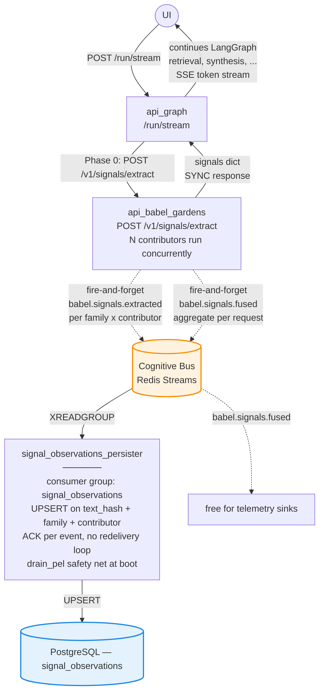

# Babel Gardens

> **Last Updated**: May 29, 2026 (v3.2)

<p class="kb-subtitle">Sacred Order #2 — Perception. Turns unstructured text into structured, auditable semantic signals with explainability. Domain-agnostic core; verticals plug their signal families in.</p>

## What it does

Babel Gardens is the **linguistic substrate** of Vitruvyan. It runs at the front of the chat pipeline (Phase 0) and on every ingested document, extracting structured signals that all downstream Orders consume.

The core ships two signal families that are useful to any vertical:

- **`language`** — detects ISO 639-1 language (~100 langs via the EmbeddingGemma cascade)
- **`conversational_sentiment`** — emits sentiment valence/magnitude with skip-if-neutral, via a deterministic local model

Everything else is **pluggable**: a vertical declares its signal families in YAML and registers contributors at startup via the `BABEL_DOMAIN` env. The chat orchestrator's Phase 0 calls one endpoint (`/v1/signals/extract`) and gets back all registered families in one shot.

- **Epistemic layer**: Perception (Linguistic Processing / Semantic Grounding)
- **Mandate**: turn multilingual text into **structured, auditable signals** + multilingual embeddings
- **Outputs**: N signal families (2 core + vertical-defined) + embeddings + cascade traces, all emitted on the Cognitive Bus with full explainability and **never raw text** (Sacred Law #2)

## Charter

### Mandate

- detect the language of the incoming text (cascade: Unicode → Qdrant/Gemma → Redis cache → LLM)
- extract per-family signals via the **`ISignalContributor`** pattern (one contributor per concern)
- emit every signal on the bus with `extraction_trace`, `confidence`, `method_used`, `interpretation` (`relative_ranking` vs `absolute_ground_truth`)
- expose multilingual embeddings (cooperative path to `api_embedding` for the corpus; in-process EmbeddingGemma for language detection)
- never store raw text — every payload carries only `text_hash = sha256(text[:200])`

### Non-goals

- no business decisions (ranking and risk scoring belong to the verticals)
- no domain ontology resolution (Pattern Weavers)
- no storage governance (Vault Keepers / Memory Orders)
- **no vertical signal definitions in the core** — schemas live under `domains/<vertical>/babel_gardens/`, never under `core/cognitive/babel_gardens/`
- no legacy `/v1/sentiment/analyze` or `/v1/emotion/detect` endpoints (retired in v3.0 — see history below)

## Signal families — core + vertical extensions

`/v1/signals/extract` runs every registered contributor in parallel and returns one **family payload** per signal family.

### Core families (always present)

| Family | Contributor | What it emits | Notes |
|---|---|---|---|
| `language` | `LanguageContributor` (cascade) | `language_detected` — ISO 639-1 | 4-tier cascade, see below |
| `conversational_sentiment` | `SentimentContributor` (deterministic local model) | `sentiment_valence` (-1..1), `sentiment_magnitude` (0..1) | Skip-if-neutral (magnitude < 0.2) — no event emitted when text is affectively flat |

Both are wired in `services/api_babel_gardens/main.py` unconditionally — they do not depend on `BABEL_DOMAIN`.

### Vertical extensions

A vertical adds its own families by:

1. Declaring them in `vitruvyan_core/domains/<vertical>/babel_gardens/signals_<vertical>.yaml` (`SignalSchema` framework — supports `value_type: float | enum | multi-enum`, with `enum_values_source` for long enums like ISO 639-1)
2. Implementing one `ISignalContributor` per family under `services/api_babel_gardens/plugins/<vertical>_*.py`
3. Registering the contributors in `main.py`'s lifespan **gated on `BABEL_DOMAIN=<vertical>`**

The Charter rule holds: **the schema lives in the vertical, not in the core**. Core stays domain-agnostic — see the [Security domain](#security-domain-vertical-extension) section below for the reference implementation.

### Anatomy of a SignalEvidence

Each contributor returns one or more `SignalEvidence` records. Every record carries:

- `signal_name`, `value`, `confidence`
- `extraction_trace.method` (e.g. `cascade:unicode-qdrant-cache-llm`, `model:<name>`, `llm:gpt-4o-mini`)
- `extraction_trace.interpretation` — `relative_ranking` (e.g. model output pending fine-tune) or `absolute_ground_truth`
- `extraction_trace.timestamp`

## The language cascade (v3.1+)

Language is a core family — same plumbing as any other contributor, no separate endpoint. The implementation is a 4-tier cascade:

```
Tier A — Unicode script        <1 ms   30 langs with unique scripts
Tier B — Qdrant semantic     ~20 ms   embeds via in-process EmbeddingGemma,
                                       searches `language_samples` collection,
                                       weighted majority vote over top-5
                                       hits with 0.1 margin guard
Tier C — Redis cache          <1 ms   text_hash → ISO 639-1, 24h TTL
Tier D — LLM fallback       150 ms   gpt-4o-mini, JSON mode, terminating
                                       guarantee (always returns a valid code)
```

Runtime order: cache → unicode → qdrant → llm. The cascade always terminates with a valid ISO 639-1 code; `auto` / `null` / `unknown` are explicitly rejected (per `docs/foundational/VITRUVYAN_OVERVIEW.md:140`).

`extraction_trace.cascade_trace` records every tier attempted, the score, the elapsed_ms, and which tier won (`method_used`).

`extraction_trace.embedding_model` reports the actually-loaded multilingual model (Gemma, or the MiniLM/mpnet fallback when the gated repo isn't accessible).

## Phase 0 — how the chat consumes signals

The chat orchestrator (`/run/stream`) runs `POST /v1/signals/extract` as Phase 0, before any LangGraph node. The response populates the LangGraph state with one key per family. Two are always present (core):

- `state["language_detected"]` ← from the `language` family
- `state["sentiment"]` ← from the `conversational_sentiment` family (may be empty if skip-if-neutral fired)

Vertical-defined families populate additional state keys — see the [Security domain](#security-domain-vertical-extension) section for an example.

Downstream nodes never re-detect; they consume from state. The chat synthesis picks the right prompt template via `PromptRegistry.get_lang_instruction(language_detected)`.

Phase 0 budget: ~6-7s wall-clock when contributors are cold; <50ms when results are cached. Non-fatal on failure — if Babel is unreachable the graph runs with `signals=None` and falls back to default behavior.

### End-to-end pipeline (Phase 0 + bus + persistence)

The full flow from the user's request through Babel, the Cognitive Bus, and into PostgreSQL. The SYNC response (graph ← signals dict) and the FIRE-AND-FORGET bus emissions happen in the **same request** — Babel writes to the bus before returning to the graph, but the graph doesn't wait on the bus.



`N contributors` = core (language + conversational_sentiment) + whatever the active `BABEL_DOMAIN` registered. The diagram applies to every vertical — only the contents of the family payloads change.

## Event contract (Cognitive Bus)

Canonical channels (declared in `vitruvyan_core/core/cognitive/babel_gardens/events/__init__.py`):

| Channel | Emitter | Consumer | Purpose |
|---|---|---|---|
| `babel.signals.extracted` | `/v1/signals/extract` (per family + contributor) | `signal_observations` (Babel persister) | One row per `(text_hash, family, contributor)`; UPSERT-merge |
| `babel.signals.fused` | `/v1/signals/extract` (once per request) | (free) | Aggregate summary — wire telemetry sinks here |

Legacy channels (`babel.sentiment.*`, `babel.emotion.*`, `babel.linguistic.*`) remain declared for compatibility but are no longer emitted. The retired `/v1/emotion/detect` HTTP endpoint and `babel_emotion` LangGraph node were removed in v3.0.

Every event payload carries:

- `text_hash` (sha256 of text[:200]) — Sacred Law #2 compliance, never raw text
- `correlation_id`, `tenant_id`
- `signal_family`, `contributor`, `signals[]`
- `timestamp` (UTC ISO 8601)

## Persistence — `signal_observations`

The Babel persister (`signal_observations_persister`) consumes `babel.signals.extracted` and upserts into PostgreSQL:

```
signal_observations
  text_hash, signal_family, contributor       — unique key (UPSERT-merge)
  signals (jsonb)                              — latest values
  payload (jsonb)                              — full event envelope
  correlation_id, tenant_id
  occurrences                                  — incremented on repeat
  first_seen_at, last_seen_at
```

The persister drains its PEL (Pending Entries List) on startup via `StreamBus.drain_pel()`, so messages stuck pending after a crash or restart are re-processed before normal consumption resumes. Same pattern is applied to the Pattern Weavers ontology persister.

## Code map

### LIVELLO 1 (pure, no I/O) — `vitruvyan_core/core/cognitive/babel_gardens/`

- `domain/signal_schema.py` — `SignalSchema` (enum + multi-enum support), `SignalConfig.from_yaml`, `enum_values_source` resolver for long enums (ISO 639-1 etc.)
- `domain/__init__.py` — re-exports `load_config_from_yaml` from `signal_schema` (canonical `SignalConfig` with `.signals` and `.get_signal()`)
- `events/__init__.py` — bus channel constants
- `signal_observations_persister.py` — standalone persister entry point
- `philosophy/charter.md` — Sacred Order charter (sanitized of vertical model names in v3.0)

### LIVELLO 2 (service + adapters) — `services/api_babel_gardens/`

- `main.py` — FastAPI lifespan: HuggingFace login process-wide, eager preload of `gemma_multilingual`, **always** registers `LanguageContributor` + `SentimentContributor`, then conditionally registers vertical contributors gated on `BABEL_DOMAIN`
- `api/routes_signals.py` — `POST /v1/signals/extract` (contributors run via `asyncio.to_thread` + `asyncio.gather`)
- `api/routes_embeddings.py` — `/v1/embeddings/create`, `/v1/embeddings/multilingual`, `/v1/embeddings/gemma` (direct EmbeddingGemma wrapper, used by the language sample seed script)
- `plugins/language_contributor.py` — language cascade (Unicode → Qdrant/Gemma → cache → LLM) — **core**
- `plugins/sentiment_contributor.py` — deterministic local sentiment model — **core**
- `plugins/<vertical>_*.py` — vertical-specific contributors (see Security domain below)
- `shared/model_manager.py` — singleton model loader; `gemma_multilingual` alias resolves `google/embeddinggemma-300m` (with MiniLM/mpnet fallback when the gated repo isn't accessible)

## Verticalization

A new vertical binds Babel Gardens by providing:

- a **signal schema YAML** at `vitruvyan_core/domains/<vertical>/babel_gardens/signals_<vertical>.yaml` (defines families + per-signal `value_type` + `enum_values_source`)
- a **vertical_config.py** (model names, cascade thresholds, fusion weights, enum constants)
- (optional) **service plugins** under `services/api_babel_gardens/plugins/<vertical>_*.py` implementing `ISignalContributor`
- a startup branch in `main.py` lifespan gated on `BABEL_DOMAIN=<vertical>` that instantiates and registers the plugins

The Charter rule still holds: **the schema lives in the vertical**, not in the Babel Gardens core. The core stays domain-agnostic. Verticals just plug.

## Security domain (vertical extension)

Aicomsec is the reference vertical. When `BABEL_DOMAIN=security` is set, the service registers two additional contributors on top of the core ones, bringing the total to **four families** at Phase 0.

### Signal families added by the security vertical

| Family | Contributor (service plugin) | Signals | Notes |
|---|---|---|---|
| `security_threat` | `secbert_contributor.py` + `security_threat_enums_contributor.py` | `threat_severity`, `exploit_imminence`, `attack_surface_exposure`, `threat_type`, `attack_phase` (MITRE), `target_asset`, `mitigation_urgency`, `compliance_implication` | SecBERT for numeric severity + LLM-as-classifier for the 5 enum signals |
| `analyst_posture` | `analyst_posture_contributor.py` | `operational_urgency` (0..1), `analyst_stance` (enum: investigative / reactive / exploratory / validating / escalating / preventive), `assertion_confidence` (0..1) | LLM-as-classifier; replaces the legacy "sentiment" framing — sentiment is the wrong term for security workflows, posture is what actually matters |

The full schema (14 signals) lives in `vitruvyan_core/domains/security/babel_gardens/signals_security.yaml`. Domain constants (`ISO_639_1_CODES`, `MITIGATION_URGENCY_ORDINAL`, cascade thresholds, LLM model names, fusion weights) live in `security_config.py`. The Tier B Qdrant seed dataset (`language_samples.yaml`, 150 phrases × 15 languages) ships under the same path.

### Phase 0 state keys (security)

In addition to the core keys (`state["language_detected"]`, `state["sentiment"]`), Phase 0 populates:

- `state["security_signals"]` ← threat signals dict
- `state["analyst_posture"]` ← posture signals dict

Downstream behavior driven by these: `compose_node` adapts response tone (urgent + reactive → action-first; exploratory → didactic).

### Observed pipeline counts (security dev stack)

A few hours of dev-stack chat traffic with `BABEL_DOMAIN=security` produced these `signal_observations` rows (illustrative, not production):

| Family | Unique rows | Occurrences (with repeat) |
|---|---|---|
| `language` | 69 | 189 |
| `security_threat` | 36 | 36 |
| `analyst_posture` | 18 | 18 |
| `conversational_sentiment` | 2 | 2 (skip-if-neutral filters most chat traffic) |

The 3× ratio on `language` is the upsert-merge cache effect — same `text_hash` recurring through the cascade increments `occurrences` without producing new rows.

## Version history

- **v3.2 (May 2026)** — `signal_observations_persister` (closes the propriocezione loop), `StreamBus.drain_pel()` safety net, `babel_emotion` graph node retired, `domain/__init__.py` redirects `load_config_from_yaml` to `signal_schema`
- **v3.1 (May 2026)** — `language` promoted to a 4th signal family, full cascade (Unicode/Qdrant/Gemma/Redis/LLM), EmbeddingGemma 300m loaded in-process, `/v1/embeddings/gemma` endpoint, `LanguageCode` enum deleted (replaced by ISO 639-1 string validation), 14 violation sites cleaned across the graph (no more `or "it"` literal fallbacks)
- **v3.0 (May 2026)** — three signal families (security_threat / analyst_posture / conversational_sentiment), Phase 0 wiring in `/run/stream`, parallel contributors, `/v1/sentiment/analyze` and `/v1/emotion/detect` HTTP endpoints retired, FinBERT references removed from core (was finance-vertical leftover; replaced with deterministic SecBERT + LLM enum classifier for the security vertical)
- **v2.1 (Feb 2026)** — `SignalSchema` abstraction, removed hardcoded sentiment/emotion in core
- **v2.0 (Feb 2026)** — SACRED_ORDER_PATTERN refactoring, domain-agnostic
- **v1.0 (Nov 2025)** — initial implementation

For the architectural rationale, see [Semantic & Ontology Architecture](../architecture/SEMANTIC_ONTOLOGY_ARCHITECTURE.md) and [Synaptic Conclave Philosophy](../architecture/SYNAPTIC_CONCLAVE_PHILOSOPHY.md).
